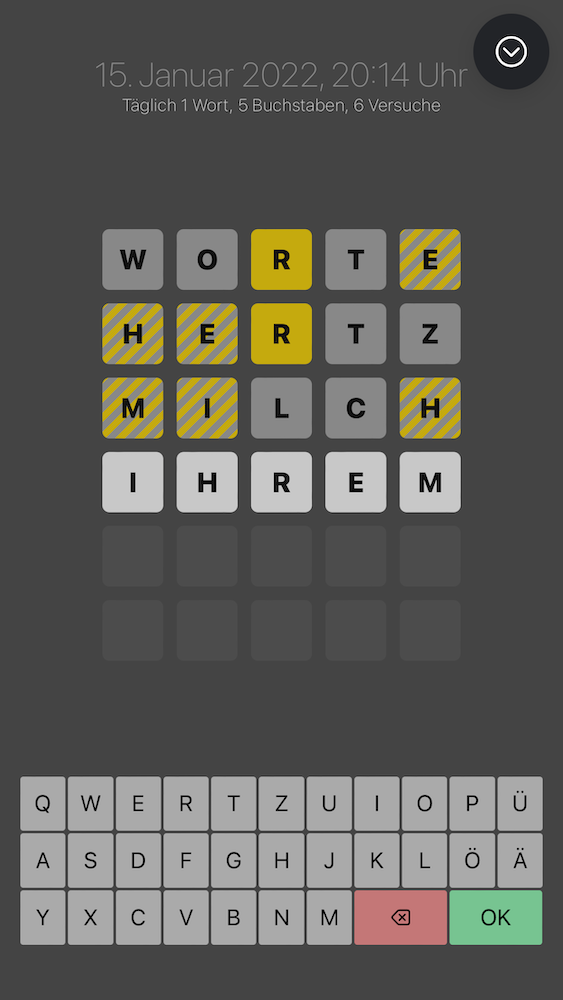

# WORTE

"_Jeden Tag 1 Wort, 5 Buchstaben, 6 Versuche._"

Ein einfaches Ratespiel, angelehnt an das "Mastermind"-Spiel. In dieser Form habe ich versucht, das Ganze für den deutschsprachigen Raum verfügbar zu machen.

Dieses Repository enthält **nicht** die Quellen für das Server-Backend und auch nicht die Liste der Wörter, die ich verwende.

## So siehts aus



## Requirements / technische Umsetzung

- Ionic + Capacitor

## Build

Für die iOS-Version sollte Folgendes ausreichen:

```zsh
$ npm install
$ ionic build --prod
$ npx cap sync 
$ npx cap open ios
```

## Notizen an mein älteres Ich

Den Live-Modus von Capacitor/Ionic startet man mit:

```zsh
$ ionic cap run ios -l --external
```

## Apple M1 Quirks

Das Google-Firebase SDK zickt ein wenig rum, wenn die iOS-Version gebaut werden soll.  
Ich habe folgende Fehlermeldung erhalten:

```
LoadError - dlopen(/Library/Ruby/Gems/2.6.0/gems/ffi-1.15.3/lib/ffi_c.bundle,
0x0009): could not use '/Library/Ruby/Gems/2.6.0/gems/ffi-1.15.3/lib/ffi_c.bundle' because it is not a compatible arch
```

Nach Hinweisen von https://github.com/CocoaPods/CocoaPods/issues/10287 haben die nachfolgenden Zeilen zum Erfolg geführt:

```zsh
$ sudo arch -x86_64 gem install ffi
```

(und ausgeführt im ios/App/Pads-Ordner:)

```zsh
$ arch -x86_64 pod install
```

## (n)FAQ

### Was soll denn "erzen" für ein Wort sein?

> Wenn die App irgendwelche Wörter nicht erkennt oder ein unsinniges Wort verwendet,  dann darfst Du das gerne melden. Ich werde die verwendeten Listen dann entsprechend anpassen.

("erzen" ist ein Adjektiv und bezeichnet ein metallenes Objekt)

### Haha, Du kannst ja nicht mal die App richtig benennen!

> Sowohl "Worte", als auch "Wörter" ist jeweils eine gültige Pluralform von "Wort". Der Unterschied war mir gar nicht mehr geläufig und es lohnt sich, das mal nachzulesen.  
> Mir ist bewusst, dass die App eigentlich WÖRTER heißen müsste, aber da das sechs Buchstaben sind, habe ich mich anders entschieden. Mea culpa. 

### Wozu das Ganze?

> Weil ich's kann. 😛
